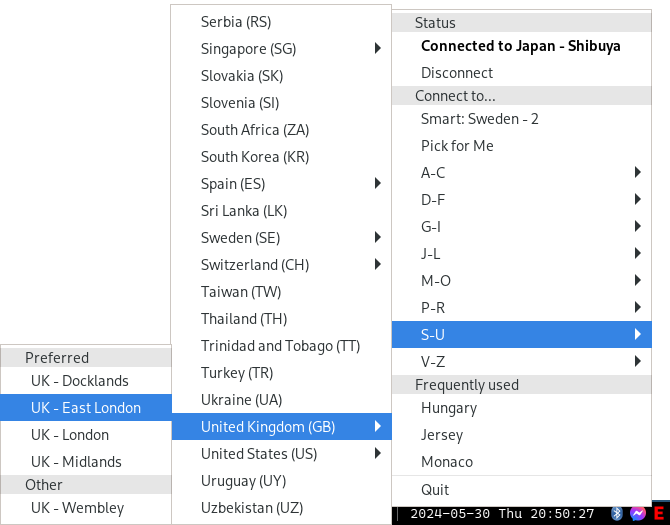

# expressvpn-applet

<table>
<tr>
<td>
Unofficial applet for ExpressVPN.

Dependencies:
- boost
- gtkmm-3.0

## Compilation

```
mkdir build
cmake . -B build -DCMAKE_INSTALL_PREFIX=/usr/local -DCMAKE_BUILD_TYPE=Release
cmake --build build
cmake --install build
```

</td>
<td>

</td>
</tr>
</table>